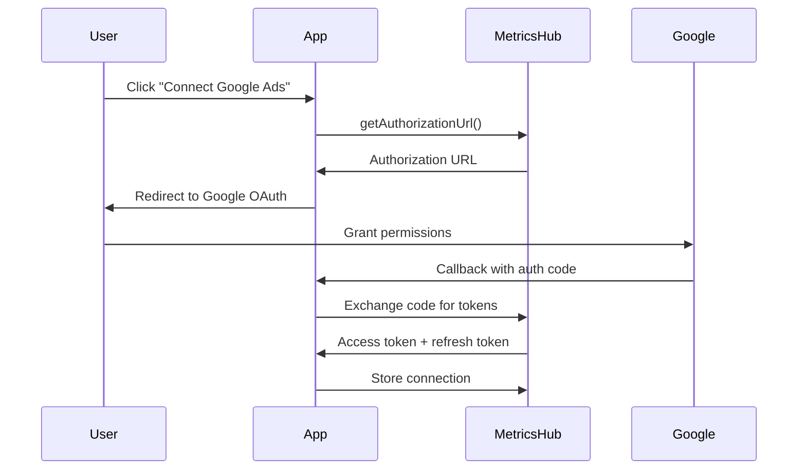

# OAuth Integration Guide

## Overview

The MetricsHub SDK provides a comprehensive OAuth management system through the `ConnectionManager` class. This guide covers everything you need to know about handling OAuth authentication, token management, and connection status for Google services.

## Table of Contents

1. [OAuth Flow Overview](#oauth-flow-overview)
2. [Connection Manager Setup](#connection-manager-setup)
3. [Token Management](#token-management)
4. [Connection Status](#connection-status)
5. [Authorization Flow](#authorization-flow)
6. [Error Handling](#error-handling)
7. [Best Practices](#best-practices)
8. [Implementation Patterns](#implementation-patterns)
9. [Troubleshooting](#troubleshooting)

---

## OAuth Flow Overview

### Standard OAuth 2.0 Flow

The MetricsHub SDK implements the standard OAuth 2.0 authorization code flow:



### Supported Providers

The SDK supports the following OAuth providers:

- `google-ads` - Google Ads API
- `google-analytics` - Google Analytics API  
- `google-sheets` - Google Sheets API
- `google-drive` - Google Drive API
- `gmail` - Gmail API
- `google-docs` - Google Docs API
- `google-search-console` - Google Search Console API

---

## Connection Manager Setup

### Basic Setup

```typescript
import { MetricsHubSDK } from '@metrics-hub/sdk';

const sdk = new MetricsHubSDK({
  companyId: 'your-company-id',
  apiBaseUrl: 'https://your-metricshub-instance.com'
});

// The connection manager is available at sdk.connection
const connectionManager = sdk.connection;
```

### Check Connection Status

Always check if a service is connected before using it:

```typescript
async function checkConnectionStatus() {
  const providers = ['google-ads', 'google-analytics', 'google-sheets'];
  
  for (const provider of providers) {
    try {
      const isConnected = await sdk.connection.isConnected(provider);
      const connectionInfo = isConnected 
        ? await sdk.connection.getConnectionInfo(provider)
        : null;
      
      console.log(`\n${provider.toUpperCase()}:`);
      console.log(`  Connected: ${isConnected ? '✅' : '❌'}`);
      
      if (connectionInfo) {
        console.log(`  Email: ${connectionInfo.email || 'N/A'}`);
        console.log(`  Scopes: ${connectionInfo.scopes.join(', ')}`);
        console.log(`  Last Refresh: ${connectionInfo.lastRefresh || 'N/A'}`);
        console.log(`  Expires: ${connectionInfo.expiresAt || 'N/A'}`);
      }
    } catch (error) {
      console.log(`${provider.toUpperCase()}: ❌ Error - ${error.message}`);
    }
  }
}
```

---

## Token Management

### Get Access Token

The SDK automatically handles token retrieval and refresh:

```typescript
async function getValidAccessToken(provider: string) {
  try {
    // Gets a valid access token, refreshing if necessary
    const token = await sdk.connection.getAccessToken(provider);
    console.log(`✅ Got valid access token for ${provider}`);
    return token;
  } catch (error) {
    console.error(`❌ Failed to get access token for ${provider}:`, error.message);
    
    if (error instanceof ConnectionError && error.expired) {
      console.log('💡 Token expired, user needs to reconnect');
      // Redirect user to OAuth flow
      return await initiateOAuthFlow(provider);
    }
    
    throw error;
  }
}
```

### Force Token Refresh

Sometimes you may need to force a token refresh:

```typescript
async function forceTokenRefresh(provider: string) {
  try {
    // Force refresh even if current token is valid
    const token = await sdk.connection.getAccessToken(provider, true);
    console.log(`✅ Forced token refresh for ${provider}`);
    return token;
  } catch (error) {
    console.error(`❌ Failed to refresh token for ${provider}:`, error.message);
    throw error;
  }
}
```

### Manual Token Refresh

For more control, you can manually refresh tokens:

```typescript
async function manualTokenRefresh(provider: string) {
  try {
    const result = await sdk.connection.refreshToken(provider);
    
    if (result.success) {
      console.log(`✅ Token refreshed for ${provider}`);
      console.log(`New token expires in: ${result.expiresIn} seconds`);
      return result.accessToken;
    } else {
      console.error(`❌ Token refresh failed: ${result.error}`);
      throw new Error(result.error);
    }
  } catch (error) {
    console.error(`❌ Manual token refresh failed:`, error.message);
    throw error;
  }
}
```

---

## Connection Status

### Validate Connection

Check if a connection is still valid:

```typescript
async function validateConnection(provider: string) {
  try {
    const isValid = await sdk.connection.validateConnection(provider);
    
    if (isValid) {
      console.log(`✅ ${provider} connection is valid`);
    } else {
      console.log(`❌ ${provider} connection is invalid`);
      
      // Try to refresh
      try {
        await sdk.connection.refreshToken(provider);
        console.log(`✅ ${provider} connection refreshed successfully`);
      } catch (refreshError) {
        console.log(`❌ ${provider} connection cannot be refreshed, re-auth needed`);
        return false;
      }
    }
    
    return true;
  } catch (error) {
    console.error(`❌ Connection validation failed for ${provider}:`, error.message);
    return false;
  }
}
```

### Get Detailed Connection Info

Get comprehensive connection information:

```typescript
async function getDetailedConnectionInfo(provider: string) {
  try {
    const info = await sdk.connection.getConnectionInfo(provider);
    
    console.log(`\n📊 Connection Details for ${provider}:`);
    console.log(`   Status: ${info.isConnected ? 'Connected ✅' : 'Disconnected ❌'}`);
    console.log(`   Email: ${info.email || 'Unknown'}`);
    console.log(`   Scopes: ${info.scopes.join(', ')}`);
    console.log(`   Last Refresh: ${info.lastRefresh?.toLocaleString() || 'Never'}`);
    console.log(`   Expires At: ${info.expiresAt?.toLocaleString() || 'Unknown'}`);
    
    // Check if token expires soon
    if (info.expiresAt) {
      const timeUntilExpiry = info.expiresAt.getTime() - Date.now();
      const hoursUntilExpiry = timeUntilExpiry / (1000 * 60 * 60);
      
      if (hoursUntilExpiry < 24) {
        console.log(`   ⚠️  Token expires in ${hoursUntilExpiry.toFixed(1)} hours`);
      }
    }
    
    return info;
  } catch (error) {
    console.error(`❌ Failed to get connection info for ${provider}:`, error.message);
    throw error;
  }
}
```

### Monitor All Connections

Monitor the status of all connected providers:

```typescript
async function monitorAllConnections() {
  try {
    const connectedProviders = await sdk.connection.getConnectedProviders();
    console.log(`\n🔍 Monitoring ${connectedProviders.length} connected providers:`);
    
    const status = {
      total: connectedProviders.length,
      active: 0,
      expiring: 0,
      expired: 0,
      details: [] as Array<{
        provider: string;
        status: 'active' | 'expiring' | 'expired';
        email?: string;
        hoursUntilExpiry?: number;
      }>
    };
    
    for (const provider of connectedProviders) {
      try {
        const info = await sdk.connection.getConnectionInfo(provider);
        
        let connectionStatus: 'active' | 'expiring' | 'expired' = 'active';
        let hoursUntilExpiry: number | undefined;
        
        if (info.expiresAt) {
          const timeUntilExpiry = info.expiresAt.getTime() - Date.now();
          hoursUntilExpiry = timeUntilExpiry / (1000 * 60 * 60);
          
          if (timeUntilExpiry <= 0) {
            connectionStatus = 'expired';
            status.expired++;
          } else if (hoursUntilExpiry < 24) {
            connectionStatus = 'expiring';
            status.expiring++;
          } else {
            status.active++;
          }
        } else {
          status.active++;
        }
        
        status.details.push({
          provider,
          status: connectionStatus,
          email: info.email,
          hoursUntilExpiry
        });
        
      } catch (error) {
        console.warn(`Failed to check ${provider}:`, error.message);
        status.details.push({
          provider,
          status: 'expired'
        });
        status.expired++;
      }
    }
    
    // Display summary
    console.log(`\n📈 Connection Status Summary:`);
    console.log(`   Total: ${status.total}`);
    console.log(`   Active: ${status.active} ✅`);
    console.log(`   Expiring Soon: ${status.expiring} ⚠️`);
    console.log(`   Expired: ${status.expired} ❌`);
    
    // Display details
    console.log(`\n📋 Detailed Status:`);
    status.details.forEach(detail => {
      const statusIcon = {
        active: '✅',
        expiring: '⚠️',
        expired: '❌'
      }[detail.status];
      
      console.log(`   ${statusIcon} ${detail.provider}`);
      if (detail.email) {
        console.log(`      Email: ${detail.email}`);
      }
      if (detail.hoursUntilExpiry !== undefined) {
        console.log(`      Expires in: ${detail.hoursUntilExpiry.toFixed(1)} hours`);
      }
    });
    
    return status;
  } catch (error) {
    console.error('❌ Failed to monitor connections:', error.message);
    throw error;
  }
}
```

---

## Authorization Flow

### Initiate OAuth Flow

Start the OAuth authorization process:

```typescript
async function initiateOAuthFlow(
  provider: string, 
  redirectUri: string = 'https://your-app.com/oauth/callback',
  customScopes?: string[]
) {
  try {
    // Define scopes per provider
    const defaultScopes = {
      'google-ads': ['https://www.googleapis.com/auth/adwords'],
      'google-analytics': ['https://www.googleapis.com/auth/analytics.readonly'],
      'google-sheets': ['https://www.googleapis.com/auth/spreadsheets'],
      'google-drive': ['https://www.googleapis.com/auth/drive.file'],
      'gmail': ['https://www.googleapis.com/auth/gmail.readonly'],
      'google-docs': ['https://www.googleapis.com/auth/documents'],
      'google-search-console': ['https://www.googleapis.com/auth/webmasters.readonly']
    };
    
    const scopes = customScopes || defaultScopes[provider as keyof typeof defaultScopes];
    
    if (!scopes) {
      throw new Error(`Unknown provider: ${provider}`);
    }
    
    const authUrl = await sdk.connection.getAuthorizationUrl(
      provider,
      redirectUri,
      scopes
    );
    
    console.log(`🔗 Authorization URL for ${provider}:`);
    console.log(authUrl);
    
    // In a web app, you would redirect the user
    // window.location.href = authUrl;
    
    return authUrl;
  } catch (error) {
    console.error(`❌ Failed to get authorization URL for ${provider}:`, error.message);
    throw error;
  }
}
```

### Handle OAuth Callback

Handle the OAuth callback in your application:

```typescript
// Express.js example
app.get('/oauth/callback', async (req, res) => {
  const { code, state, error } = req.query;
  
  if (error) {
    console.error('OAuth error:', error);
    return res.status(400).json({ error: 'OAuth authorization failed' });
  }
  
  if (!code) {
    return res.status(400).json({ error: 'Missing authorization code' });
  }
  
  try {
    // The state parameter should contain the provider info
    const provider = state as string;
    
    // Exchange the authorization code for tokens
    // This would typically be handled by your backend
    const tokenResponse = await exchangeCodeForTokens(code as string, provider);
    
    if (tokenResponse.success) {
      console.log(`✅ Successfully connected ${provider}`);
      
      // Redirect to success page
      res.redirect('/dashboard?connected=' + provider);
    } else {
      throw new Error(tokenResponse.error);
    }
    
  } catch (error) {
    console.error('OAuth callback error:', error);
    res.redirect('/dashboard?error=oauth_failed');
  }
});

// This function would be implemented in your backend
async function exchangeCodeForTokens(code: string, provider: string) {
  // Implementation depends on your backend setup
  // This typically involves calling your MetricsHub API endpoint
  // that handles the OAuth code exchange
  return { success: true };
}
```

### Complete OAuth Setup Example

Full implementation for React app with Express backend:

```typescript
// Frontend: React component
import React, { useState, useEffect } from 'react';

interface ConnectionStatusProps {
  provider: string;
  displayName: string;
}

const ConnectionStatus: React.FC<ConnectionStatusProps> = ({ provider, displayName }) => {
  const [isConnected, setIsConnected] = useState(false);
  const [connectionInfo, setConnectionInfo] = useState(null);
  const [loading, setLoading] = useState(true);

  useEffect(() => {
    checkConnectionStatus();
  }, [provider]);

  const checkConnectionStatus = async () => {
    try {
      setLoading(true);
      const connected = await sdk.connection.isConnected(provider);
      setIsConnected(connected);
      
      if (connected) {
        const info = await sdk.connection.getConnectionInfo(provider);
        setConnectionInfo(info);
      }
    } catch (error) {
      console.error(`Failed to check ${provider} status:`, error);
    } finally {
      setLoading(false);
    }
  };

  const handleConnect = async () => {
    try {
      const authUrl = await sdk.connection.getAuthorizationUrl(
        provider,
        `${window.location.origin}/oauth/callback?provider=${provider}`
      );
      
      window.location.href = authUrl;
    } catch (error) {
      console.error(`Failed to initiate OAuth for ${provider}:`, error);
    }
  };

  const handleDisconnect = async () => {
    if (window.confirm(`Disconnect ${displayName}?`)) {
      try {
        await sdk.connection.revokeConnection(provider);
        setIsConnected(false);
        setConnectionInfo(null);
      } catch (error) {
        console.error(`Failed to disconnect ${provider}:`, error);
      }
    }
  };

  if (loading) {
    return <div>Checking {displayName} connection...</div>;
  }

  return (
    <div className="connection-status">
      <div className="connection-header">
        <h3>{displayName}</h3>
        <div className={`status ${isConnected ? 'connected' : 'disconnected'}`}>
          {isConnected ? '✅ Connected' : '❌ Not Connected'}
        </div>
      </div>
      
      {isConnected && connectionInfo && (
        <div className="connection-details">
          <p>Email: {connectionInfo.email}</p>
          <p>Last Refresh: {connectionInfo.lastRefresh?.toLocaleString()}</p>
          {connectionInfo.expiresAt && (
            <p>Expires: {connectionInfo.expiresAt.toLocaleString()}</p>
          )}
        </div>
      )}
      
      <div className="connection-actions">
        {isConnected ? (
          <button onClick={handleDisconnect} className="disconnect-btn">
            Disconnect
          </button>
        ) : (
          <button onClick={handleConnect} className="connect-btn">
            Connect {displayName}
          </button>
        )}
        
        {isConnected && (
          <button onClick={checkConnectionStatus} className="refresh-btn">
            Refresh Status
          </button>
        )}
      </div>
    </div>
  );
};

// Usage
const ConnectionDashboard: React.FC = () => {
  return (
    <div className="connection-dashboard">
      <h2>Connected Services</h2>
      
      <ConnectionStatus provider="google-ads" displayName="Google Ads" />
      <ConnectionStatus provider="google-analytics" displayName="Google Analytics" />
      <ConnectionStatus provider="google-sheets" displayName="Google Sheets" />
      <ConnectionStatus provider="google-drive" displayName="Google Drive" />
    </div>
  );
};
```

---

## Error Handling

### OAuth-Specific Error Handling

```typescript
import { ConnectionError, MetricsHubError } from '@metrics-hub/sdk';

async function safeConnectionOperation(provider: string, operation: () => Promise<any>) {
  try {
    return await operation();
  } catch (error) {
    if (error instanceof ConnectionError) {
      if (error.expired) {
        console.log(`🔄 ${provider} token expired, attempting refresh...`);
        
        try {
          await sdk.connection.refreshToken(provider);
          console.log(`✅ ${provider} token refreshed, retrying operation`);
          return await operation();
        } catch (refreshError) {
          console.log(`❌ ${provider} token refresh failed, user needs to reconnect`);
          throw new Error(`Please reconnect your ${provider} account`);
        }
      } else {
        console.log(`❌ ${provider} connection error:`, error.message);
        throw new Error(`${provider} connection failed: ${error.message}`);
      }
    } else if (error instanceof MetricsHubError && error.statusCode === 401) {
      console.log(`🔐 ${provider} authentication failed`);
      throw new Error(`Please check your ${provider} permissions and reconnect`);
    } else {
      console.error(`❌ Unexpected error with ${provider}:`, error);
      throw error;
    }
  }
}

// Usage example
async function getCampaignsWithErrorHandling(customerId: string) {
  return safeConnectionOperation('google-ads', async () => {
    return await sdk.ads.getCampaigns(customerId);
  });
}
```

### Comprehensive Error Recovery

```typescript
class ConnectionRecoveryManager {
  private maxRetries = 3;
  private retryDelay = 1000;

  async executeWithRecovery<T>(
    provider: string,
    operation: () => Promise<T>
  ): Promise<T> {
    let attempt = 0;
    
    while (attempt < this.maxRetries) {
      try {
        return await operation();
      } catch (error) {
        attempt++;
        
        if (error instanceof ConnectionError && error.expired) {
          console.log(`Attempt ${attempt}: Token expired for ${provider}, refreshing...`);
          
          try {
            await sdk.connection.refreshToken(provider);
            console.log(`Token refreshed for ${provider}`);
          } catch (refreshError) {
            if (attempt >= this.maxRetries) {
              throw new Error(`${provider} token refresh failed after ${this.maxRetries} attempts`);
            }
            console.log(`Token refresh failed, will retry in ${this.retryDelay}ms`);
            await this.wait(this.retryDelay * attempt);
          }
        } else if (attempt >= this.maxRetries) {
          throw error;
        } else {
          console.log(`Attempt ${attempt} failed, retrying in ${this.retryDelay}ms`);
          await this.wait(this.retryDelay * attempt);
        }
      }
    }
    
    throw new Error(`Operation failed after ${this.maxRetries} attempts`);
  }

  private wait(ms: number): Promise<void> {
    return new Promise(resolve => setTimeout(resolve, ms));
  }
}

// Usage
const recoveryManager = new ConnectionRecoveryManager();

async function robustApiCall() {
  return recoveryManager.executeWithRecovery('google-ads', async () => {
    return await sdk.ads.getCampaigns('123456789');
  });
}
```

---

## Best Practices

### 1. Connection Health Monitoring

Set up regular connection health checks:

```typescript
class ConnectionHealthMonitor {
  private checkInterval = 60000; // 1 minute
  private healthCheckTimer?: NodeJS.Timeout;
  private providers: string[] = ['google-ads', 'google-analytics', 'google-sheets'];

  start() {
    console.log('🏥 Starting connection health monitor');
    this.performHealthCheck();
    this.healthCheckTimer = setInterval(() => {
      this.performHealthCheck();
    }, this.checkInterval);
  }

  stop() {
    if (this.healthCheckTimer) {
      clearInterval(this.healthCheckTimer);
      console.log('🏥 Connection health monitor stopped');
    }
  }

  private async performHealthCheck() {
    console.log('🔍 Performing connection health check...');
    
    for (const provider of this.providers) {
      try {
        const isValid = await sdk.connection.validateConnection(provider);
        
        if (!isValid) {
          console.log(`⚠️ ${provider} connection is unhealthy`);
          await this.handleUnhealthyConnection(provider);
        } else {
          console.log(`✅ ${provider} connection is healthy`);
        }
      } catch (error) {
        console.error(`❌ Health check failed for ${provider}:`, error.message);
      }
    }
  }

  private async handleUnhealthyConnection(provider: string) {
    try {
      console.log(`🔄 Attempting to refresh ${provider} connection...`);
      await sdk.connection.refreshToken(provider);
      console.log(`✅ ${provider} connection refreshed successfully`);
    } catch (error) {
      console.error(`❌ Failed to refresh ${provider} connection`);
      // Notify user or take other action
      this.notifyConnectionIssue(provider);
    }
  }

  private notifyConnectionIssue(provider: string) {
    // Implement notification logic (email, push notification, etc.)
    console.log(`📧 Notifying user about ${provider} connection issue`);
  }
}
```

### 2. Efficient Token Management

Implement token caching and preemptive refresh:

```typescript
class TokenManager {
  private tokenCache = new Map<string, { token: string; expiresAt: Date }>();
  private refreshThreshold = 300000; // Refresh if expires within 5 minutes

  async getToken(provider: string): Promise<string> {
    const cached = this.tokenCache.get(provider);
    
    if (cached) {
      const timeUntilExpiry = cached.expiresAt.getTime() - Date.now();
      
      if (timeUntilExpiry > this.refreshThreshold) {
        return cached.token;
      }
      
      console.log(`🔄 Token for ${provider} expires soon, refreshing preemptively`);
    }

    return await this.refreshAndCacheToken(provider);
  }

  private async refreshAndCacheToken(provider: string): Promise<string> {
    try {
      const token = await sdk.connection.getAccessToken(provider, true);
      
      // Get connection info to determine expiry
      const connectionInfo = await sdk.connection.getConnectionInfo(provider);
      const expiresAt = connectionInfo.expiresAt || new Date(Date.now() + 3600000); // 1 hour default
      
      this.tokenCache.set(provider, { token, expiresAt });
      
      return token;
    } catch (error) {
      this.tokenCache.delete(provider);
      throw error;
    }
  }

  clearCache(provider?: string) {
    if (provider) {
      this.tokenCache.delete(provider);
    } else {
      this.tokenCache.clear();
    }
  }
}
```

### 3. Graceful Degradation

Handle connection failures gracefully:

```typescript
class ServiceManager {
  private connectionManager: ConnectionManager;
  private fallbackData = new Map<string, any>();

  constructor(connectionManager: ConnectionManager) {
    this.connectionManager = connectionManager;
  }

  async getDataWithFallback<T>(
    provider: string,
    dataFetcher: () => Promise<T>,
    fallbackKey: string
  ): Promise<{ data: T | null; fromCache: boolean; error?: string }> {
    try {
      // Check connection first
      const isConnected = await this.connectionManager.isConnected(provider);
      
      if (!isConnected) {
        return this.getFallbackData<T>(fallbackKey);
      }

      // Attempt to fetch fresh data
      const data = await dataFetcher();
      
      // Cache the successful result
      this.fallbackData.set(fallbackKey, {
        data,
        timestamp: Date.now()
      });
      
      return { data, fromCache: false };
    } catch (error) {
      console.warn(`Failed to fetch fresh data for ${provider}:`, error.message);
      return this.getFallbackData<T>(fallbackKey);
    }
  }

  private getFallbackData<T>(key: string): { data: T | null; fromCache: boolean; error?: string } {
    const cached = this.fallbackData.get(key);
    
    if (cached) {
      const ageMs = Date.now() - cached.timestamp;
      const ageHours = ageMs / (1000 * 60 * 60);
      
      console.log(`📦 Using cached data (${ageHours.toFixed(1)} hours old)`);
      
      return {
        data: cached.data,
        fromCache: true,
        error: 'Using cached data due to connection issues'
      };
    }
    
    return {
      data: null,
      fromCache: false,
      error: 'No connection and no cached data available'
    };
  }
}

// Usage
const serviceManager = new ServiceManager(sdk.connection);

async function getCampaignsWithFallback(customerId: string) {
  return serviceManager.getDataWithFallback(
    'google-ads',
    () => sdk.ads.getCampaigns(customerId),
    `campaigns_${customerId}`
  );
}
```

---

## Implementation Patterns

### 1. Multi-Provider Setup

Handle multiple OAuth providers in a single interface:

```typescript
class MultiProviderOAuthManager {
  private providers = [
    { key: 'google-ads', name: 'Google Ads', scopes: ['https://www.googleapis.com/auth/adwords'] },
    { key: 'google-analytics', name: 'Google Analytics', scopes: ['https://www.googleapis.com/auth/analytics.readonly'] },
    { key: 'google-sheets', name: 'Google Sheets', scopes: ['https://www.googleapis.com/auth/spreadsheets'] }
  ];

  async getConnectionStatuses() {
    const statuses = await Promise.all(
      this.providers.map(async (provider) => {
        try {
          const isConnected = await sdk.connection.isConnected(provider.key);
          const info = isConnected 
            ? await sdk.connection.getConnectionInfo(provider.key)
            : null;
          
          return {
            provider: provider.key,
            name: provider.name,
            connected: isConnected,
            info
          };
        } catch (error) {
          return {
            provider: provider.key,
            name: provider.name,
            connected: false,
            error: error.message
          };
        }
      })
    );

    return statuses;
  }

  async connectProvider(providerKey: string, redirectUri: string) {
    const provider = this.providers.find(p => p.key === providerKey);
    if (!provider) {
      throw new Error(`Unknown provider: ${providerKey}`);
    }

    return await sdk.connection.getAuthorizationUrl(
      provider.key,
      redirectUri,
      provider.scopes
    );
  }

  async disconnectProvider(providerKey: string) {
    return await sdk.connection.revokeConnection(providerKey);
  }

  async refreshAllConnections() {
    const results = await Promise.allSettled(
      this.providers.map(async (provider) => {
        try {
          await sdk.connection.refreshToken(provider.key);
          return { provider: provider.key, success: true };
        } catch (error) {
          return { provider: provider.key, success: false, error: error.message };
        }
      })
    );

    return results.map((result, index) => ({
      provider: this.providers[index].key,
      ...((result as PromiseFulfilledResult<any>).value || { success: false })
    }));
  }
}
```

### 2. Plugin OAuth Integration

Handle OAuth in plugin context:

```typescript
class PluginOAuthManager {
  private pluginId: string;
  private requiredProviders: string[];

  constructor(pluginId: string, requiredProviders: string[]) {
    this.pluginId = pluginId;
    this.requiredProviders = requiredProviders;
  }

  async checkRequiredConnections() {
    const missing = [];
    const connected = [];

    for (const provider of this.requiredProviders) {
      try {
        const isConnected = await sdk.connection.isConnected(provider);
        if (isConnected) {
          connected.push(provider);
        } else {
          missing.push(provider);
        }
      } catch (error) {
        missing.push(provider);
      }
    }

    return { connected, missing };
  }

  async initializePlugin() {
    const { connected, missing } = await this.checkRequiredConnections();

    if (missing.length > 0) {
      console.log(`❌ Plugin ${this.pluginId} missing connections:`, missing);
      throw new Error(`Missing required connections: ${missing.join(', ')}`);
    }

    console.log(`✅ Plugin ${this.pluginId} has all required connections:`, connected);
    return true;
  }

  async getConnectionUrls(baseRedirectUri: string) {
    const { missing } = await this.checkRequiredConnections();
    
    const urls = await Promise.all(
      missing.map(async (provider) => {
        const redirectUri = `${baseRedirectUri}?plugin=${this.pluginId}&provider=${provider}`;
        const authUrl = await sdk.connection.getAuthorizationUrl(provider, redirectUri);
        return { provider, authUrl };
      })
    );

    return urls;
  }
}
```

---

## Troubleshooting

### Common OAuth Issues

#### 1. Invalid Redirect URI

```typescript
async function troubleshootRedirectUri(provider: string, redirectUri: string) {
  console.log(`🔍 Troubleshooting redirect URI for ${provider}`);
  console.log(`Redirect URI: ${redirectUri}`);
  
  // Check if the URI is properly encoded
  try {
    const decoded = decodeURIComponent(redirectUri);
    const encoded = encodeURIComponent(decoded);
    
    if (redirectUri !== encoded) {
      console.log('⚠️ Redirect URI encoding issue detected');
      console.log(`Original: ${redirectUri}`);
      console.log(`Should be: ${encoded}`);
    }
  } catch (error) {
    console.log('❌ Invalid URI encoding');
  }
  
  // Check if the URI uses HTTPS (required for production)
  if (!redirectUri.startsWith('https://') && !redirectUri.startsWith('http://localhost')) {
    console.log('⚠️ Redirect URI should use HTTPS in production');
  }
  
  // Validate URI structure
  try {
    const url = new URL(redirectUri);
    console.log('✅ Redirect URI is valid');
    console.log(`   Protocol: ${url.protocol}`);
    console.log(`   Host: ${url.host}`);
    console.log(`   Path: ${url.pathname}`);
  } catch (error) {
    console.log('❌ Invalid redirect URI structure');
  }
}
```

#### 2. Scope Issues

```typescript
async function troubleshootScopes(provider: string) {
  const requiredScopes = {
    'google-ads': ['https://www.googleapis.com/auth/adwords'],
    'google-analytics': ['https://www.googleapis.com/auth/analytics.readonly'],
    'google-sheets': ['https://www.googleapis.com/auth/spreadsheets']
  };
  
  try {
    const connectionInfo = await sdk.connection.getConnectionInfo(provider);
    const grantedScopes = connectionInfo.scopes;
    const required = requiredScopes[provider as keyof typeof requiredScopes] || [];
    
    console.log(`🔍 Scope analysis for ${provider}:`);
    console.log(`Required scopes:`, required);
    console.log(`Granted scopes:`, grantedScopes);
    
    const missing = required.filter(scope => !grantedScopes.includes(scope));
    const extra = grantedScopes.filter(scope => !required.includes(scope));
    
    if (missing.length > 0) {
      console.log(`❌ Missing scopes:`, missing);
      console.log(`💡 User needs to reconnect with additional permissions`);
    }
    
    if (extra.length > 0) {
      console.log(`ℹ️ Extra scopes granted:`, extra);
    }
    
    if (missing.length === 0) {
      console.log(`✅ All required scopes are granted`);
    }
    
    return { missing, extra, sufficient: missing.length === 0 };
  } catch (error) {
    console.error(`❌ Failed to analyze scopes for ${provider}:`, error.message);
    return { missing: [], extra: [], sufficient: false };
  }
}
```

#### 3. Token Expiry Issues

```typescript
async function troubleshootTokenExpiry(provider: string) {
  try {
    const connectionInfo = await sdk.connection.getConnectionInfo(provider);
    
    if (!connectionInfo.expiresAt) {
      console.log(`ℹ️ ${provider} token has no expiry information`);
      return;
    }
    
    const now = Date.now();
    const expiresAt = connectionInfo.expiresAt.getTime();
    const timeUntilExpiry = expiresAt - now;
    
    console.log(`🕐 Token expiry analysis for ${provider}:`);
    console.log(`   Current time: ${new Date(now).toLocaleString()}`);
    console.log(`   Expires at: ${connectionInfo.expiresAt.toLocaleString()}`);
    
    if (timeUntilExpiry <= 0) {
      console.log(`❌ Token expired ${Math.abs(timeUntilExpiry / 1000 / 60)} minutes ago`);
      
      try {
        await sdk.connection.refreshToken(provider);
        console.log(`✅ Token refreshed successfully`);
      } catch (refreshError) {
        console.log(`❌ Token refresh failed:`, refreshError.message);
        console.log(`💡 User needs to reconnect`);
      }
    } else {
      const hours = timeUntilExpiry / 1000 / 60 / 60;
      
      if (hours < 1) {
        console.log(`⚠️ Token expires in ${Math.round(timeUntilExpiry / 1000 / 60)} minutes`);
      } else if (hours < 24) {
        console.log(`⚠️ Token expires in ${hours.toFixed(1)} hours`);
      } else {
        console.log(`✅ Token expires in ${Math.round(hours / 24)} days`);
      }
    }
  } catch (error) {
    console.error(`❌ Failed to analyze token expiry for ${provider}:`, error.message);
  }
}
```

This comprehensive OAuth guide covers all aspects of authentication and connection management in the MetricsHub SDK. Use these patterns and best practices to build robust, reliable OAuth integrations.